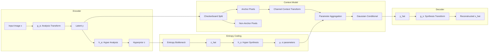
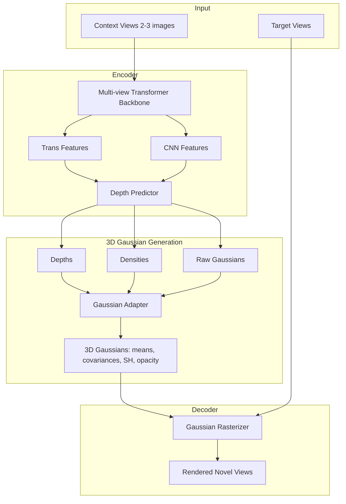

# Project Architecture Deep Dive

A comprehensive analysis of the thesis project covering the ELIC-ReImplementation (learned image compression) and MVSplat (novel view synthesis) codebases.

> Note: this is a legacy deep dive from an earlier iteration of the repo. Some scripts/paths have changed in this clean restart; for the current baseline workflow see `docs/REPRODUCING.md`.

---

## Project Overview

| Component | Description | Key Paper |
|-----------|-------------|-----------|
| **ELIC-ReImplementation** | Learned image compression | ELIC: CVPR 2022 |
| **MVSplat** | 3D Gaussian Splatting for novel view synthesis | MVSplat: ECCV 2024 Oral |

Both projects share the **RealEstate10K** dataset for training/evaluation.

---

## 1. ELIC-ReImplementation

### Architecture Overview



### Key Components

#### 1.1 Main Network ([Network.py](../../third_party/ELiC-ReImplemetation/Network.py))

The `TestModel` class extends `CompressionModel` from CompressAI with:

| Component | Description | Line Range |
|-----------|-------------|------------|
| `g_a` | Analysis transform (encoder): 3→N→N→N→M channels, 4 downsampling stages | L88-104 |
| `g_s` | Synthesis transform (decoder): M→N→N→N→3 channels, 4 upsampling stages | L106-122 |
| `h_a` | Hyper analysis: M→N→N (computes hyperprior) | L124-130 |
| `h_s` | Hyper synthesis: N→N→2M (predicts mean/scale) | L132-138 |
| `cc_transforms` | Channel context transforms for slice dependencies | L140-149 |
| `context_prediction` | Checkerboard masked convolutions | L151-155 |
| `ParamAggregation` | Combines context, hyperprior, and slice information | L157-166 |

#### 1.2 Unevenly Grouped Channel Slicing

```python
self.groups = [0, 16, 16, 32, 64, 192]  # Line 87
```

The 320-channel latent `y` is split into 5 slices with sizes: **16, 16, 32, 64, 192**

> [!IMPORTANT]
> The first slice (16 channels) has no dependencies. Slice i depends on slice 0 and slice i-1.

#### 1.3 Checkerboard Context Model

The [CheckboardMaskedConv2d](../../third_party/ELiC-ReImplemetation/ELICUtilis/layers/layers.py#L64-88) creates a two-pass context:

```
Anchor pattern (encoded first):     Non-anchor pattern (encoded second):
  0 1 0 1 0                           1 0 1 0 1
  1 0 1 0 1                           0 1 0 1 0
  0 1 0 1 0                           1 0 1 0 1
```

This allows parallel encoding within each pass while maintaining spatial dependencies.

---

### Metrics Calculation

#### PSNR Calculation ([Inference.py:48-50](../../third_party/ELiC-ReImplemetation/Inference.py#L48-50))

```python
def psnr(a: torch.Tensor, b: torch.Tensor) -> float:
    mse = torch.nn.functional.mse_loss(a, b).item()
    return -10 * math.log10(mse)
```

> [!NOTE]
> **Measured against**: Original input image `x` vs reconstructed `x_hat`
> **Value range**: Tensors are in `[0, 1]` (normalized RGB)
> **No cropping**: Padding is applied for divisibility, then cropped back before metric calculation

#### MS-SSIM Calculation ([Inference.py:114](../../third_party/ELiC-ReImplemetation/Inference.py#L114))

```python
ms_ssim(x, out_dec["x_hat"], data_range=1.0).item()
```

Uses `pytorch_msssim` library with `data_range=1.0`.

#### BPP (Bits Per Pixel) Calculation ([Inference.py:91-104](../../third_party/ELiC-ReImplemetation/Inference.py#L91-107))

```python
num_pixels = x.size(0) * x.size(2) * x.size(3)
bpp = total_bytes * 8.0 / num_pixels
```

Split into:
- `y_bpp`: Main latent bitrate  
- `z_bpp`: Hyperprior bitrate

#### Padding Strategy ([Inference.py:66-76](../../third_party/ELiC-ReImplemetation/Inference.py#L66-76))

```python
p = patch  # default 64
new_h = (h + p - 1) // p * p  # Round up to multiple of patch
padding_right = new_w - w
padding_bottom = new_h - h
```

> [!WARNING]
> Padding is applied to bottom-right only (not symmetric). After decoding, padding is removed before metric calculation.

---

### Training Loss ([train.py:39-67](../../third_party/ELiC-ReImplemetation/train.py#L39-67))

```python
class RateDistortionLoss(nn.Module):
    def forward(self, output, target):
        # BPP loss: sum of log-likelihoods
        bpp_loss = sum(
            (torch.log(likelihoods).sum() / (-math.log(2) * num_pixels))
            for likelihoods in output["likelihoods"].values()
        )
        # MSE loss: scaled by 255^2 for RGB range
        mse_loss = self.mse(output["x_hat"], target) * 255 ** 2
        # Combined RD loss
        loss = self.lmbda * mse_loss + bpp_loss
```

| Lambda (λ) | Quality Level | Checkpoint |
|------------|---------------|------------|
| 0.45 | Highest quality | Available |
| 0.15 | High quality | Available |
| 0.032 | Medium quality | Available |
| 0.016 | Lower quality | Available |
| 0.008 | Low quality | Available |
| 0.004 | Lowest quality | Available |

---

## 2. MVSplat

### Architecture Overview



### Key Components

#### 2.1 Encoder ([encoder_costvolume.py](../../third_party/mvsplat/src/model/encoder/encoder_costvolume.py))

| Component | Purpose |
|-----------|---------|
| `BackboneMultiview` | Multi-view transformer with optional epipolar attention |
| `DepthPredictorMultiView` | Cost volume-based depth estimation |
| `GaussianAdapter` | Converts features + depth to 3D Gaussians |

#### 2.2 Decoder Output

Produces `Gaussians` with:
- **means**: 3D positions
- **covariances**: 3x3 matrices
- **harmonics**: Spherical harmonic coefficients for view-dependent color
- **opacities**: Per-Gaussian transparency

---

### Metrics Calculation

#### PSNR ([metrics.py:11-19](../../third_party/mvsplat/src/evaluation/metrics.py#L11-19))

```python
def compute_psnr(ground_truth, predicted):
    ground_truth = ground_truth.clip(min=0, max=1)
    predicted = predicted.clip(min=0, max=1)
    mse = reduce((ground_truth - predicted) ** 2, "b c h w -> b", "mean")
    return -10 * mse.log10()
```

#### SSIM ([metrics.py:36-52](../../third_party/mvsplat/src/evaluation/metrics.py#L36-52))

Uses `skimage.metrics.structural_similarity` with:
- `win_size=11`
- `gaussian_weights=True`
- `data_range=1.0`

#### LPIPS ([metrics.py:27-33](../../third_party/mvsplat/src/evaluation/metrics.py#L27-33))

Uses VGG-based LPIPS from the `lpips` library:
```python
LPIPS(net="vgg").forward(ground_truth, predicted, normalize=True)
```

---

### Training Losses

| Loss | Weight | Description |
|------|--------|-------------|
| MSE | configurable | Pixel-wise reconstruction |
| LPIPS | applied after N steps | Perceptual similarity |
| Depth | optional | Depth supervision |

---

## 3. Shared Dataset: RealEstate10K

### Dataset Structure

```
dataset/
├── re10k/
│   ├── train/
│   │   ├── index.json
│   │   └── *.torch (chunked data files)
│   └── test/
│       ├── index.json
│       └── *.torch
└── re10k.zip (~500GB)
```

### Data Format ([dataset_re10k.py](../../third_party/mvsplat/src/dataset/dataset_re10k.py))

| Field | Description |
|-------|-------------|
| `images` | List of JPEG-encoded images (360×640) |
| `cameras` | 18-dim vector: [fx, fy, cx, cy, ...extrinsics_12] |
| `key` | Scene identifier |

### Image Size

```python
# Expected shape for RealEstate10K
context_images.shape[1:] == (3, 360, 640)
```

---

## 4. Key Differences in Metric Calculation

| Aspect | ELIC | MVSplat |
|--------|------|---------|
| **Task** | Image reconstruction | Novel view synthesis |
| **Ground truth** | Original input image | Target view image |
| **PSNR formula** | Same | Same |
| **SSIM variant** | MS-SSIM | SSIM (skimage) |
| **Perceptual** | Not used in inference | LPIPS (VGG) |
| **Padding** | Bottom-right only | Patch-based shim |

---

## 5. File Reference Summary

### ELIC-ReImplementation

| File | Purpose |
|------|---------|
| [Network.py](../../third_party/ELiC-ReImplemetation/Network.py) | Main model architecture |
| [train.py](../../third_party/ELiC-ReImplemetation/train.py) | Training loop with RD loss |
| [Inference.py](../../third_party/ELiC-ReImplemetation/Inference.py) | Evaluation with metrics |
| [updata.py](../../third_party/ELiC-ReImplemetation/updata.py) | Entropy model update |
| [ELICUtilis/layers/layers.py](../../third_party/ELiC-ReImplemetation/ELICUtilis/layers/layers.py) | CheckboardMaskedConv2d, AttentionBlock |

### MVSplat

| File | Purpose |
|------|---------|
| [model_wrapper.py](../../third_party/mvsplat/src/model/model_wrapper.py) | Main training/eval wrapper |
| [encoder_costvolume.py](../../third_party/mvsplat/src/model/encoder/encoder_costvolume.py) | Cost volume encoder |
| [metrics.py](../../third_party/mvsplat/src/evaluation/metrics.py) | PSNR, SSIM, LPIPS |
| [dataset_re10k.py](../../third_party/mvsplat/src/dataset/dataset_re10k.py) | RealEstate10K dataset loader |

---

## 6. V1 Baseline Implementation

The V1 system inserts ELIC compression upstream of MVSplat for controlled study of compression effects on novel-view synthesis.

### Scripts (current repo)

| Script | Location | Purpose |
|--------|----------|---------|
| [eval_baselines.py](../../experiments/eval/eval_baselines.py) | Baselines | Evaluate **vanilla** + **vanilla ELIC→MVSplat** baselines on the fixed eval index; reads bpp from `manifest.csv`. |
| [eval_fair_mvsplat.py](../../experiments/eval/eval_fair_mvsplat.py) | Evaluator | Fixed-index evaluator used by baselines and E2E (optionally swaps in decoded contexts and reads bpp from `manifest.csv`). |
| [plot_fair_rd.py](../../experiments/plot_fair_rd.py) | Plotting | Plot RD curves from the CSV output of `eval_fair_mvsplat.py`. |
| [generate_re10k_evaluation_index.py](../../scripts/indices/generate_re10k_evaluation_index.py) | Indices | Optional: regenerate `assets/indices/re10k/evaluation_index_re10k.json` using MVSplat’s generator. |

### Usage Workflow (V1 baseline)

```bash
# Optional: deep-verify the committed eval index against your local dataset.
python scripts/verify_eval_index.py assets/indices/re10k/evaluation_index_re10k.json --check-dataset

# Step 1: evaluate baselines (vanilla + vanilla ELIC→MVSplat) into one CSV.
python experiments/eval/eval_baselines.py \\
  --compressed-base outputs/v1_baseline/compressed \\
  --out-csv outputs/v1_baseline/results/fair_rd.csv

# Step 3: plot RD curves.
bash scripts/plot_fair_rd.sh
```

### Output Structure (V1)

```
outputs/v1_baseline/
├── compressed/
│   └── lambda_<λ>/
│       ├── recon/<scene>/<frame>.png
│       └── manifest.csv
└── results/
    ├── fair_rd.csv
    └── plots/fair_rd_psnr.pdf
```
